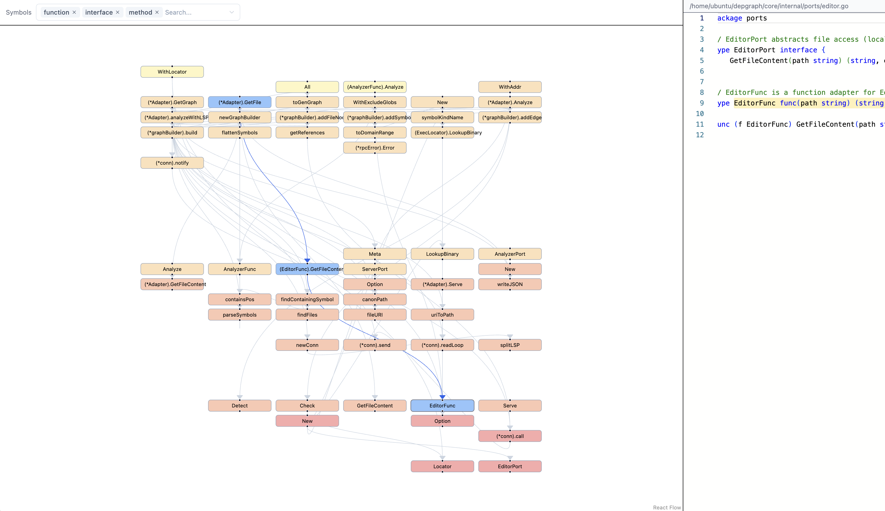

# depgraph

A CLI tool that visualizes source code dependency graphs in your browser using LSP-based static analysis.

> **Docs:** [Architecture (C4 model, API, ports & adapters)](./_docs/architecture.md)

## Try it out

> [!NOTE]
> Currently, I only tested it with Go project.

```sh
curl -L -o depgraph https://github.com/sundaycrafts/depgraph/releases/latest/download/depgraph-linux-amd64
./depgraph <project root> --exclude=<grob pattern>
# e.g. depgraph core --exclude=**/*_test.go --exclude=**/main.go --exclude=**/*.gen.go
```



---

## Prerequisites

- Go 1.22+
- Node.js 20+ (LTS)
- [`oapi-codegen`](https://github.com/oapi-codegen/oapi-codegen) — install once:
  ```sh
  go install github.com/oapi-codegen/oapi-codegen/v2/cmd/oapi-codegen@latest
  ```
- Language server for the language(s) you want to analyze:

  | Language   | Language Server            | Install                                               |
  |------------|----------------------------|-------------------------------------------------------|
  | Go         | gopls                      | `go install golang.org/x/tools/gopls@latest`          |
  | Rust       | rust-analyzer              | `rustup component add rust-analyzer`                  |
  | TypeScript | typescript-language-server | `npm install -g typescript-language-server typescript` |

  Language detection is automatic — the target directory is scanned for `go.mod`, `Cargo.toml`, or `tsconfig.json`.

---

## Getting Started

```sh
git clone https://github.com/sundaycrafts/depgraph
cd depgraph

# Install web dependencies
cd web && npm install && cd ..

# Generate types from OpenAPI spec (both Go and TypeScript)
make gen

# Start dev servers (Go :8080 + Vite :5173 with proxy)
make dev TARGET_DIR=/path/to/project
```

Open [http://localhost:5173](http://localhost:5173) in your browser.

---

## Common Commands

| Command | Description |
|---|---|
| `make gen` | Regenerate `core/gen/api.gen.go` and `web/src/gen/api.ts` from `api/openapi.yaml` |
| `make build` | Production build — outputs a single Go binary with the web SPA embedded |
| `make dev TARGET_DIR=<path> [DEPGRAPH_ARGS='...']` | Start Go server (`:8080`) and Vite dev server (`:5173`) in parallel |
| `make test` | Run `go test ./...` and `npm test` |

---

## Monorepo Layout

| Directory | Language | Role |
|---|---|---|
| `api/` | YAML | OpenAPI spec — single source of truth for types |
| `core/` | Go | CLI, analysis engine, HTTP server |
| `web/` | TypeScript / React | Browser UI (embedded into the Go binary at build time) |
| `_docs/` | Markdown | Design documents |

---

## Usage

```sh
# Development
make dev TARGET_DIR=/path/to/project

# Production binary
depgraph <target-dir> [--exclude <glob>]...
```

Analyzes `<target-dir>` via LSP, starts a local HTTP server, and opens the graph in your browser.

### Excluding files

`--exclude` accepts [doublestar](https://github.com/bmatcuk/doublestar) glob patterns matched against paths relative to `<target-dir>`. The flag is repeatable. Hidden entries (starting with `.`) are always skipped; everything else must be excluded explicitly.

```sh
# Skip Go test files and the vendor tree
depgraph ./core --exclude='**/*_test.go' --exclude='vendor/**'

# TypeScript: skip node_modules and *.test.ts / *.spec.ts
depgraph ./web --exclude='node_modules/**' --exclude='**/*.test.ts' --exclude='**/*.spec.ts'

# Through the Makefile
make dev TARGET_DIR=$PWD/core DEPGRAPH_ARGS='--exclude=**/*_test.go --exclude=vendor/**'
```

---

## Releasing

1. Merge all changes to `main` and verify CI passes.
2. Tag the commit and push:
   ```sh
   git tag v1.2.3
   git push origin v1.2.3
   ```
3. GitHub Actions builds binaries for Linux and macOS (amd64 + arm64) and publishes a GitHub Release automatically.
